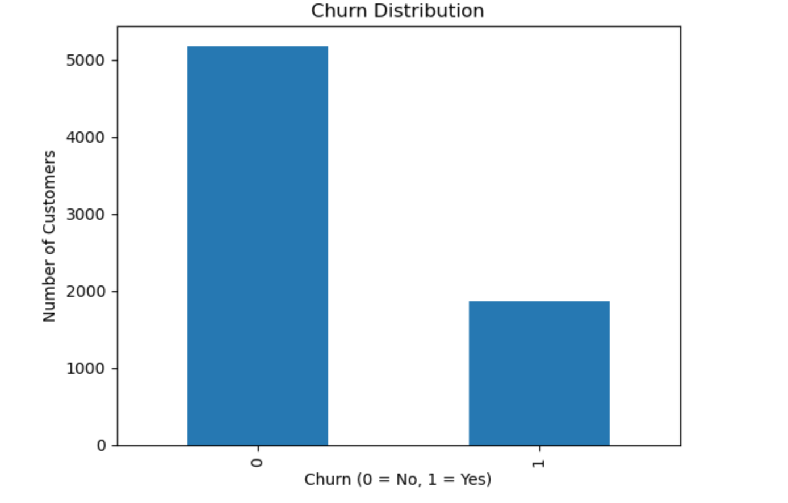
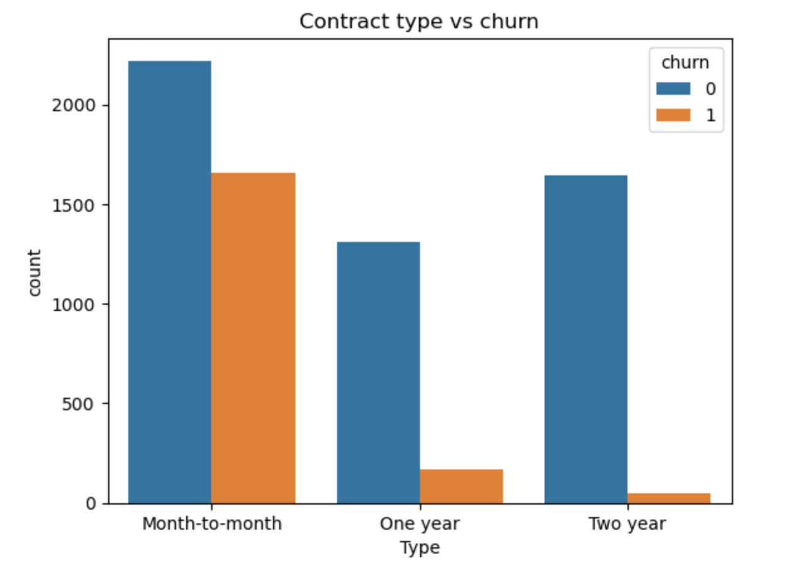
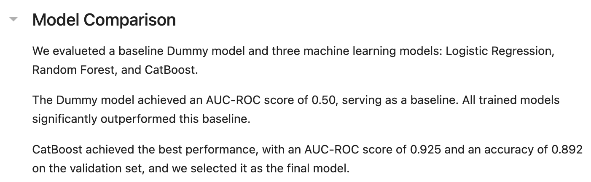
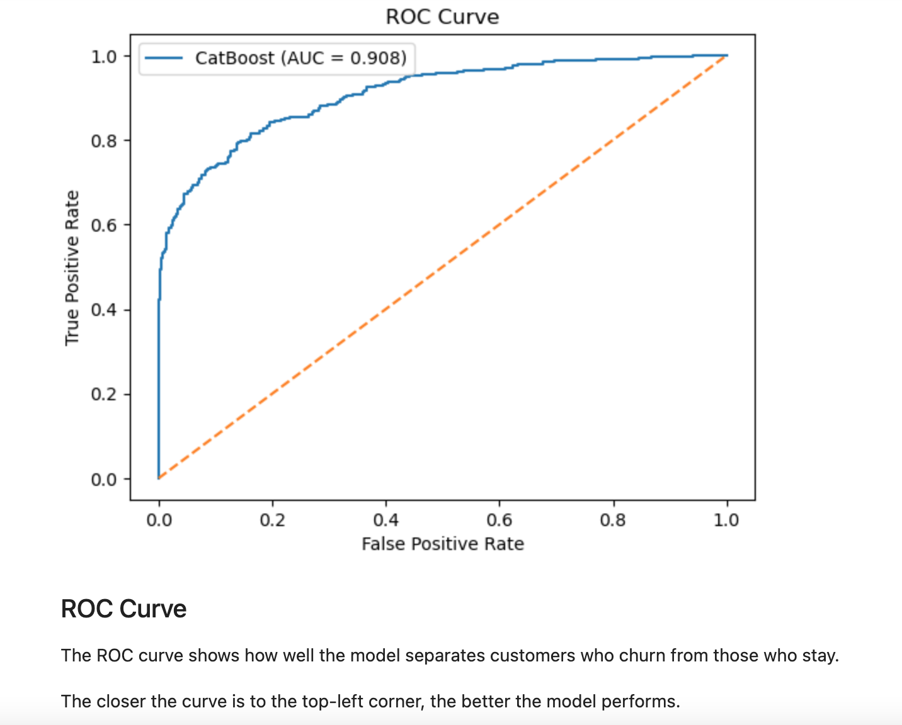

# Customer Churn Prediction

## Overview
This project focuses on predicting which customers are likely to leave a telecom company.

## Goal
The goal was to build a machine learning model that identifies high-risk customers and helps support retention strategies.

## What I Did
- Combined multiple datasets into one unified dataset
- Performed exploratory data analysis to identify key patterns
- Engineered features such as tenure
- Trained multiple models including Logistic Regression, Random Forest, and CatBoost
- Selected the best model based on performance

## Results
- Achieved an AUC-ROC of 0.90
- Identified key drivers of churn such as contract type, tenure, and monthly charges

## Tools Used
- Python
- Pandas
- Scikit-learn
- CatBoost

## Project Visuals

### Churn Distribution

### Contract Type vs Churn

### Model Comparison

### ROC Curve (Model Performance)

